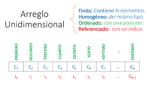
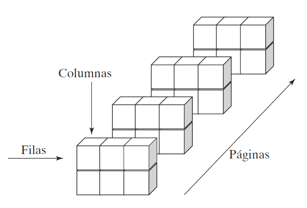
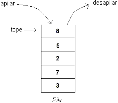
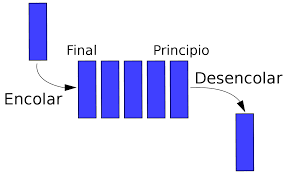
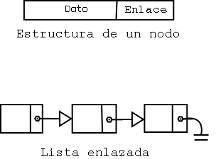
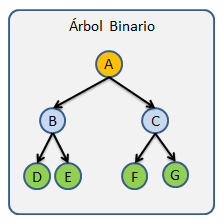
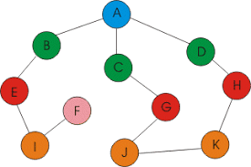
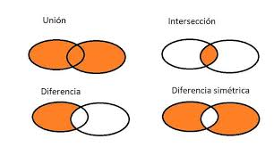
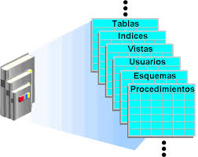

# Estructura de datos

Una estructura de datos es una forma organizada de almacenar y gestionar información dentro de un programa para que pueda ser utilizada de manera eficiente.
Un tipo de dato abstracto (TDA) define un conjunto de datos y las operaciones que se pueden realizar sobre ellos, sin preocuparse por cómo están implementados internamente.

## Clasificación de las estructuras de datos

## Lineales

Los datos se organizan de manera secuencial, donde cada elemento tiene un predecesor y un sucesor (excepto el primero y el último).

- **Arreglos**
- **Pilas**
- **Colas**
- **Listas enlazadas**

## Arreglos

Un arreglo (array) es una colección de elementos del mismo tipo, almacenados de forma contigua en memoria.
Los elementos se acceden mediante índices.

- **Unidimensional (vector/array)**
 Es una estructura de datos que almacena una colección ordenada de elementos del mismo tipo, accesibles a través de un solo índice. Se puede visualizar como una fila con casillas, donde cada casilla (posición) contiene un dato y es identificada por un número de índice.

 ```c#
 using System;

class Program
{
    static void Main()
    {
        int[] numeros = { 10, 20, 30, 40, 50 };

        Console.WriteLine("Elementos del arreglo:");
        for (int i = 0; i < numeros.Length; i++)
        {
            Console.WriteLine($"Índice {i}: {numeros[i]}");
        }
    }
}
 ```

 

- **Multidimensional (matriz, etc)**

Un arreglo multidimensional es una estructura de datos que almacena elementos organizados en más de una dimensión, como una tabla con filas y columnas.

```c#
using System;

class Program
{
    static void Main()
    {
        int[,] matriz = { { 1, 2 }, { 3, 4 }, { 5, 6 } };

        Console.WriteLine("Elementos de la matriz:");
        for (int i = 0; i < 3; i++)
        {
            for (int j = 0; j < 2; j++)
            {
                Console.Write(matriz[i, j] + " ");
            }
            Console.WriteLine();
        }
    }
}
```



## Pilas

Estructura de datos que sigue el principio LIFO (Last In - First Out), lo que indica que el ultimo en entrar sera el primero
en salir.

Donde las operaciones tipicas son:

- **Push** agregar elemento.  
- **Pop** eliminar elemento.
- **Peek** → ver el elemento superior sin eliminarlo.

```c#
using System;
using System.Collections.Generic;

class Program
{
    static void Main()
    {
        // Pila de enteros
        Stack<int> pila = new Stack<int>();

        // Agregar elementos (Push)
        pila.Push(10);
        pila.Push(20);
        pila.Push(30);

        Console.WriteLine("Contenido actual de la pila:");
        foreach (int elemento in pila)
        {
            Console.WriteLine(elemento);
        }

        // Consultar el elemento superior (Peek)
        Console.WriteLine($"\nElemento en la cima: {pila.Peek()}");

        // Eliminar el elemento superior (Pop)
        pila.Pop();

        Console.WriteLine("\nPila después de eliminar un elemento:");
        foreach (int elemento in pila)
        {
            Console.WriteLine(elemento);
        }
    }
}
```



## Cola

Una Cola es una estructura de datos que sigue el principio FIFO (First In, First Out).
Esto significa que el primer elemento en entrar es el primero en salir.
Las operaciones tipicas son:

- **Enqueue** agregar un elemento al final de la cola.
- **Dequeue** eliminar el primer elemento.
- **Peek** devuelve el primer elemento sin eliminarlo.

```c#
using System;
using System.Collections.Generic;

class Program
{
    static void Main()
    {
        // Cola de enteros
        Queue<int> cola = new Queue<int>();

        // Agregar elementos (Enqueue)
        cola.Enqueue(10);
        cola.Enqueue(20);
        cola.Enqueue(30);

        Console.WriteLine("Contenido actual de la cola:");
        foreach (int elemento in cola)
        {
            Console.WriteLine(elemento);
        }

        // Consultar el elemento superior (Peek)
        Console.WriteLine($"\nElemento en la cima: {cola.Peek()}");

        // Eliminar el elemento superior (Enqueue)
        cola.Dequeue();

        Console.WriteLine("\nCola después de eliminar un elemento:");
        foreach (int elemento in cola)
        {
            Console.WriteLine(elemento);
        }
    }
}
```



## Listas enlazadas

Una lista enlazada está formada por nodos, donde cada nodo contiene un valor y una referencia (enlace) al siguiente nodo.
Tipos principales:

- **Simplemente enlazada:** cada nodo apunta solo al siguiente.
- **Doblemente enlazada:** cada nodo apunta al anterior y al siguiente.
- **Circular:** el último nodo apunta de nuevo al primero.

```c#
using System;
using System.Collections.Generic;

class Program
{
    static void Main()
    {
        // Lista enlazada de cadenas
        LinkedList<string> lista = new LinkedList<string>();

        // Agregar elementos al final
        lista.AddLast("A");
        lista.AddLast("B");
        lista.AddLast("C");

        Console.WriteLine("Lista enlazada actual:");
        foreach (var elemento in lista)
        {
            Console.WriteLine(elemento);
        }

        // Agregar un elemento al inicio
        lista.AddFirst("Inicio");

        // Eliminar un elemento
        lista.Remove("B");

        Console.WriteLine("\nLista después de modificaciones:");
        foreach (var elemento in lista)
        {
            Console.WriteLine(elemento);
        }
    }
}
```



## No lineales

En estas estructuras los elementos no se almacenan de forma secuencial, sino que se organizan jerárquica o relacionalmente.
Incluyen:

- **Árboles**
- **Grafos**

## Árboles

Un árbol es una estructura jerárquica compuesta por nodos conectados por ramas.
El nodo superior se llama raíz, y los demás son hijos.

- **Árbol binario de búsqueda (ABB)**

Cada nodo tiene a lo sumo dos hijos:
Los valores menores van a la izquierda.
Los mayores van a la derecha.

```c#
using System;

class Nodo
{
    public int Valor;
    public Nodo Izquierdo, Derecho;

    public Nodo(int valor) => Valor = valor;
}

class ArbolBinario
{
    public Nodo Raiz;

    public void Insertar(int valor) => Raiz = InsertarRec(Raiz, valor);

    private Nodo InsertarRec(Nodo raiz, int valor)
    {
        if (raiz == null)
            return new Nodo(valor);

        if (valor < raiz.Valor)
            raiz.Izquierdo = InsertarRec(raiz.Izquierdo, valor);
        else if (valor > raiz.Valor)
            raiz.Derecho = InsertarRec(raiz.Derecho, valor);

        return raiz;
    }

    public void InOrden(Nodo raiz)
    {
        if (raiz != null)
        {
            InOrden(raiz.Izquierdo);
            Console.Write(raiz.Valor + " ");
            InOrden(raiz.Derecho);
        }
    }
}

class Program
{
    static void Main()
    {
        ArbolBinario arbol = new ArbolBinario();
        arbol.Insertar(50);
        arbol.Insertar(30);
        arbol.Insertar(70);
        arbol.Insertar(20);
        arbol.Insertar(40);

        Console.WriteLine("Recorrido In-Orden:");
        arbol.InOrden(arbol.Raiz);
    }
}
```



## Grafos

Un grafo es un conjunto de nodos (vértices) conectados mediante aristas (edges).
Puede ser dirigido (las conexiones tienen dirección) o no dirigido.

```c#
using System;
using System.Collections.Generic;

class Grafo
{
    private Dictionary<string, List<string>> listaAdyacencia = new Dictionary<string, List<string>>();

    public void AgregarVertice(string vertice)
    {
        if (!listaAdyacencia.ContainsKey(vertice))
            listaAdyacencia[vertice] = new List<string>();
    }

    public void AgregarArista(string origen, string destino)
    {
        listaAdyacencia[origen].Add(destino);
    }

    public void Mostrar()
    {
        foreach (var vertice in listaAdyacencia)
        {
            Console.Write($"{vertice.Key} → ");
            foreach (var ady in vertice.Value)
                Console.Write($"{ady} ");
            Console.WriteLine();
        }
    }
}

class Program
{
    static void Main()
    {
        Grafo grafo = new Grafo();
        grafo.AgregarVertice("A");
        grafo.AgregarVertice("B");
        grafo.AgregarVertice("C");

        grafo.AgregarArista("A", "B");
        grafo.AgregarArista("A", "C");
        grafo.AgregarArista("B", "C");

        grafo.Mostrar();
    }
}
```



## Abstractas

Los tipos de datos abstractos (TDA) se definen por las operaciones que realizan, no por su implementación.
Incluyen:

- Conjunto
- Diccionario

## **Conjunto (Set)**

Un conjunto es una estructura de datos que almacena elementos únicos, sin duplicados, y no mantiene un orden específico. En Python, se define con llaves {} o con la función set(). Es ideal para operaciones matemáticas como uniones, intersecciones y diferencias.
**Características principales**

- *Elementos únicos*: No permite duplicados; si se intenta añadir un elemento repetido, se ignora.
- *Desordenado*: Los elementos no tienen un índice ni un orden definido.- - 
- *Mutable*: Se pueden añadir o eliminar elementos, pero los elementos en sí deben ser inmutables (por ejemplo, números, cadenas o tuplas).
- *No admite indexación*: No se puede acceder a elementos por índices como en listas.
**Acciones principales**

- Crear un conjunto.
- Agregar elementos:
 add(elemento): Añade un elemento al conjunto.
- Eliminar elementos:
 remove(elemento): Elimina un elemento; lanza un error si no existe.
 discard(elemento): Elimina un elemento; no lanza error si no existe.
 pop(): Elimina y retorna un elemento aleatorio.
 clear(): Vacía el conjunto.
- Operaciones de conjuntos:
 Unión ( o union()): Combina todos los elementos de dos conjuntos.
 Intersección (& o intersection()): Devuelve los elementos comunes.
 Diferencia (- o difference()): Elementos que están en un conjunto pero no en otro.
 Diferencia simétrica (^ o symmetric_difference()): Elementos que están en uno u otro, pero no en ambos.
- Verificaciones:  
 in: Verifica si un elemento está en el conjunto.
 issubset(): Comprueba si un conjunto es subconjunto de otro.
 issuperset(): Comprueba si un conjunto contiene a otro.

```c#
using System;
using System.Collections.Generic;

class Program
{
    static void Main()
    {
        HashSet<int> conjunto = new HashSet<int> { 1, 2, 3, 3, 4 };

        Console.WriteLine("Elementos del conjunto:");
        foreach (var item in conjunto)
            Console.WriteLine(item);

        conjunto.Add(5);
        conjunto.Remove(2);

        Console.WriteLine("\nDespués de modificaciones:");
        foreach (var item in conjunto)
            Console.WriteLine(item);
    }
}
```



## **Diccionarios**

Un diccionario es una estructura de datos que almacena pares clave-valor, donde cada clave es única y está asociada a un valor. En Python, se define con llaves {clave: valor} o con la función dict().
**Características principales**

- *Claves únicas*: Cada clave debe ser única e inmutable (por ejemplo, cadenas, números, tuplas).
- *Valores flexibles*: Los valores pueden ser de cualquier tipo (números, listas, otros diccionarios, etc.).
- *Mutable*: Se pueden modificar, añadir o eliminar pares clave-valor.-
- *Acceso por clave*: Los elementos se acceden mediante sus claves, no por índices.
- *Desordenado (en versiones de Python < 3.7)*: Desde Python 3.7, los diccionarios mantienen el orden de inserción.
**Acciones principales**

- Agregar elementos:
 Se usa el método Add(clave, valor) o el operador de índice diccionario[clave] = valor;.
- Acceder a un valor mediante su clave:
 Se usa el nombre del diccionario seguido de la clave entre corchetes.
También se puede usar TryGetValue() para evitar errores si la clave no existe.
- Modificar un valor existente:
 Se puede actualizar asignando un nuevo valor a una clave existente.
- Eliminar un elemento:
 Se usa Remove(clave) para eliminar un par clave–valor.
- Comprobar si una clave o valor existe:
 Se utilizan los métodos ContainsKey() o ContainsValue().
- Recorrer todos los elementos:
 Se pueden recorrer con un foreach para acceder a todas las claves y valores.
- Limpiar el diccionario:
 El método Clear() elimina todos los elementos del diccionario.

```c#
using System;
using System.Collections.Generic;

class Program
{
    static void Main()
    {
        Dictionary<string, int> edades = new Dictionary<string, int>
        {
            { "Ana", 25 },
            { "Luis", 30 },
            { "María", 22 }
        };

        Console.WriteLine("Diccionario de personas:");
        foreach (var kvp in edades)
            Console.WriteLine($"{kvp.Key}: {kvp.Value} años");

        edades["Luis"] = 31;
        edades.Add("Carlos", 27);

        Console.WriteLine("\nDespués de modificaciones:");
        foreach (var kvp in edades)
            Console.WriteLine($"{kvp.Key}: {kvp.Value} años");
    }
}
```

